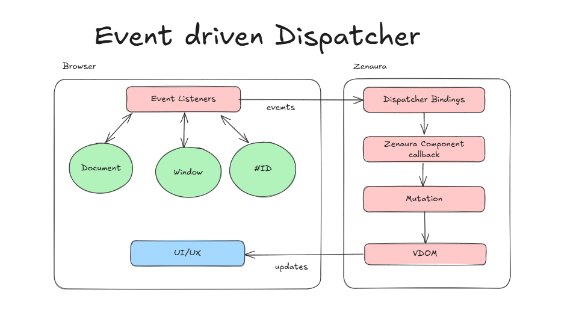

# Zenaura Data Binding Model Guide


Data binding is a powerful technique that allows seamless synchronization between the user interface and the underlying data model. In Zenaura, data binding facilitates automatic updates to the UI when the state changes, enabling a reactive and efficient user experience. This guide will walk you through the fundamentals of data binding in Zenaura components.

## Understanding Data Binding in Components

Data binding in Zenaura involves creating a connection between the component's state and the UI elements, ensuring that changes in the state are reflected in the UI and vice versa.

The way zenaura implement synchronization between the user interface and the underlying data model is through dispacher and mutations. Mutations are event handlers decorated with mutator. Use mutator over an event handler if and only if we want the component to re-render. The data can still be synced if we set the state within event handler, without re-rendering the component.

Dispacher allows you to bind mutation to document, window, element by id events, such when button clicked submit the form and re-render to show a message.

### Example of a Simple Data Binding Component

Let's create a simple form component to demonstrate how data binding works in Zenaura.

```python
from zenaura.client.component import Component
from zenaura.client.tags.builder import Builder
from zenaura.client.mutator import mutator
from zenaura.client.dispacher import dispatcher
class SimpleForm(Component):
    def __init__(self):
        super().__init__()
        self.set_state({"inputValue": ""})

    # note here we did not pass re-render
    # we just want to grap the user input value
    async def update_input(self, event):
        new_value = event.target.value
        self.set_state({"inputValue": new_value})

    def render(self):
        input_value = self.get_state()["inputValue"]
        return Builder("div").with_children([
            Builder("input")
                .with_attribute("value", input_value)
                .with_attribute("py-change", f"{self.instance_name}.update_input")
                .with_attribute("id", "my-input")
                .build(),
            Builder("p")
                .with_text(f"Current input: {input_value}")
                .build()
        ]).build()

simple_form = SimpleForm()
# dispatcher.bind("element_id", "event_name",  component.callback)
dispatcher.bind("my-input", "change",  simple_form.update_input)

```

### Explanation

1. **Initialization**: The `SimpleForm` component initializes its state with an `inputValue` key, set to an empty string.
2. **Mutator**: The `update_input` method updates the `inputValue` state based on the user's input.
3. **Rendering**: The `render` method constructs the UI using the `Builder` interface. It creates an input field bound to `inputValue` and a paragraph element to display the current input value.
4. **dispacher**: The 'dispatcher.bind" will add event listener on the input using the input id, with event change, whenever the user enter data, the data will be sent to the callback via the event argument.

## Two-Way Data Binding

Two-way data binding ensures that changes in the UI update the component's state and that changes in the state update the UI. This is essential for creating interactive forms and inputs.

Make sure to use text, node via builder `.with_text` for state variables zenaura will sanitize the data for you.
