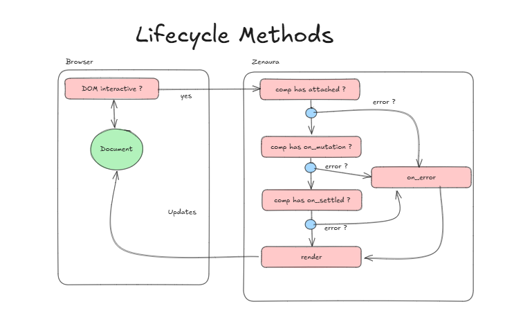

## Lifecycle Methods: A Deep Dive into Zenaura's Virtual DOM Component Management

Zenaura's component lifecycle management, facilitated by its virtual DOM (VDOM), offers a structured approach to handling component interactions within a web application's UI. Understanding these lifecycle methods is crucial for developers seeking to optimize component behavior and create seamless user experiences. Note the component lifecycle start with attached and until the last lifecycle which is on_settled. Within every transition even inside a lifecycle, on_error is there to gracefully handle errors.


### **Mount LifeCycles: Initializing Component Presence**

The `MountLifeCycles` class, extending `HydratorVirtualDomAdapter`, focuses on the initial stages of a component's lifecycle when it's integrated into the DOM:

- **`attached(comp)` (async):** This method is triggered immediately after a component is mounted onto the DOM. It serves as the ideal space for essential setup tasks:
    - **State Initialization:** Establish the component's internal data and variables.
    - **Event Listener Setup:** Attach handlers to respond to user interactions or other events.
    - **API Calls:** Fetch external data to populate or update the component.
    - **Animations:** Initiate visual transitions or effects upon mounting.

```python
async def attached(self, comp):
    if hasattr(comp, 'attached'):
        await comp.attached()
```

**Key Point:** The `attached` method only executes if the component itself defines an `attached` method. This flexibility allows developers to customize component behavior as needed.

### **Render LifeCycle: Managing Component Updates**

The `RenderLifeCycle` class focuses on the dynamic aspects of a component's existence, particularly when updates and re-renders occur:

- **`on_mutation(comp)` (async):** This method is invoked before the actual DOM update takes place. It's designed for tasks that need to be executed right before the component's visual representation is altered:
    - **State Updates Based on Props:** Modify the component's internal state based on changes in its props (data passed from parent components).
    - **Pre-Update API Calls or Logic:** Perform any necessary calculations or data fetching before the UI is refreshed.

```python
async def on_mutation(self, comp):
    if hasattr(comp, 'on_mutation'):
        await comp.on_mutation()
```

- **`on_settled(comp)` (async):** This method is activated after the DOM update is complete and the component has settled into its new state. It's ideal for post-render actions:
    - **Focusing Elements:** Automatically place the user's cursor in an input field.
    - **Scrolling:** Programmatically scroll the page to a specific section or element.
    - **Custom Events:** Trigger events to notify other parts of your application about the update.

```python
async def on_settled(self, comp):
    if hasattr(comp, 'on_settled'):
        await comp.on_settled()
```

Absolutely! Let's add the `on_error` lifecycle method to our deep dive guide:

### Error Handling with `on_error`

In addition to the standard lifecycle methods, Zenaura provides the `on_error` lifecycle method to gracefully handle errors that might occur during the rendering process.

- **`on_error(comp, error)` (async):** This method is triggered if an error is raised while a component is being rendered or updated. It receives two arguments:
    - `comp`: The component instance where the error occurred.
    - `error`: The exception object representing the error.

```python
async def on_error(self, comp, error):
    if hasattr(comp, 'on_error'):
        await comp.on_error(error)
```

**Purpose:** The primary purpose of `on_error` is to allow you to:

- **Log the Error:**  Record details about the error for debugging and analysis.
- **Display User-Friendly Messages:**  Present a clear and informative error message to the user, rather than a technical stack trace.
- **Fallback UI:**  Render alternative content or a simplified version of the component to maintain some level of functionality.
- **State Recovery:**  Attempt to recover from the error by resetting the component's state or taking other corrective actions.

### Example Usage

```python
class MyComponent:
    # ... other lifecycle methods ...

    async def on_error(self, error):
        print(f"Error in MyComponent: {error}")  # Log the error
        self.state['error_message'] = "An error occurred while loading data."  # Update UI with error message
```

In this example, the `on_error` method logs the error to the console and updates the component's state to display an error message to the user.

### Best Practices

- **Always Define `on_error`:**  Include the `on_error` method in your components, even if you initially just log the error. It's better to have a basic error handler in place than to let errors crash your application silently.
- **Be Specific:**  Tailor your error handling to the specific types of errors that might occur in each component.
- **Prioritize User Experience:**  Focus on providing clear and helpful error messages to guide the user.
- **Logging:** Use logging to record error details for later analysis.

By incorporating the `on_error` lifecycle method and following these best practices, you can create more robust and user-friendly Zenaura components that can gracefully recover from unexpected errors.


### **Why Lifecycle Methods Matter**

Understanding and utilizing lifecycle methods in Zenaura's VDOM system empowers developers to:

- **Organize Logic:** Break down complex component behavior into well-defined stages.
- **Optimize Performance:** Execute tasks precisely when needed, avoiding unnecessary computations.
- **Enhance User Experience:**  Create smooth, visually appealing updates and transitions.
- **Customize Behavior:** Tailor each component's lifecycle to suit specific requirements.

### **Example Usage**

```python
class MyComponent:
    async def attached(self):
        # Fetch initial data from API
        self.data = await fetch_data()

    async def on_mutation(self):
        # Update state based on props if needed
        if self.props['filter'] != self.state['filter']:
            self.state['filter'] = self.props['filter']
            self.data = await fetch_filtered_data(self.state['filter'])

    async def on_settled(self):
        # Highlight the selected item in a list after re-render
        highlight_selected_item()
```

In this example, the `attached` method fetches initial data, `on_mutation` handles state updates and subsequent data filtering, and `on_settled` manages UI interactions after the update.

