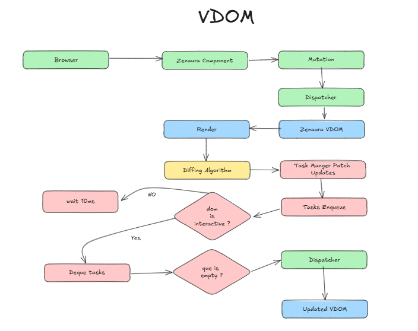

# Zenaura Virtual DOM: A Conceptual Deep Dive
 
Zenaura's Virtual DOM revolutionizes how you build dynamic web interfaces. It introduces a layer of abstraction between your UI components and the browser's actual DOM, enabling faster updates and a smoother user experience.

## 1. The Power of the Virtual DOM


* **What is it?**  The VDOM is a lightweight in-memory representation of your web page's structure, similar to a JavaScript object. It mirrors the real DOM but is much faster to manipulate.

* **Why use it?** Directly updating the actual DOM can be slow and inefficient. The VDOM allows Zenaura to intelligently determine the minimal set of changes needed and apply them efficiently, resulting in improved performance.

## 2. How Zenaura VDOM Works

1. **Initial Render:** When your Zenaura components render, they create a VDOM tree. This tree represents the initial state of your UI.
2. **State Changes:** Data within your components are linked to mutators which are user events that when changed (e.g., through user interactions or API calls), the associated components re-render, creating a new VDOM tree.
3. **Diffing (Reconciliation):** Zenaura compares the old VDOM tree with the new one to identify the differences. This process is called "diffing" or "reconciliation."
4. **Efficient Updates:** Zenaura applies only the necessary changes to the real DOM, updating elements, attributes, or text content as needed. It gather all the updates, intelligently determine the minimal set of operations, patch and schedule the update to the real DOM in asyncrounous non-blocking way. This insure smooth user experience, and very low latency, and fast app rendering.

## 3. The Role of Zenaura Components

* **Building Blocks:** Your UI is composed of Zenaura `Component` classes. Each component defines its structure (`render` method) and how it reacts to data changes.

* **Data-Driven:** Components are data-driven. They render their structure based on their internal `state`. When state changes, the `render` method is called again, generating a new VDOM.

* **Mutators (Optional):** Zenaura provides the `@mutator` decorator for methods that modify component state. This ensures the VDOM is efficiently re-render the component intentionally, minimizing poor UI/UX resulting from developers re-rendering the component unintentionally.

* **Lifecycle methods:** Components can define lifecycle methods that extend the functionality of the component, you might want to do something before the component renders so you use `attached` lifecycle method, you might want to do something before the component re-renders so you use `on_mutation` lifecycle method, you might want to do something after the component re-renders so you use `on_seatled`, finally you might want to catch errors in the component so you use `on_error` lifecycle method. There is dedicated guides in advanced concepts section for lifecycle methods and handling errors.

## 4. Zenaura VDOM in Action: Code Snippet

```python
@Reuseable  # Marks the component as potentially having multiple instances
class Counter(Component):
    # ... (state, mutators)

    def render(self) -> Node:
        # Create VDOM nodes (div, button, etc.) based on component state
        # ...
```

In this example:

* `Counter` is a reusable component representing a counter widget.
* The `render` method constructs a VDOM tree describing the component's structure.
* User actions (like clicking buttons) trigger mutators that update the state, causing `render` to be called again, and the VDOM to be refreshed.

## Benefits of Zenaura VDOM

* **Performance:** Minimizes expensive DOM manipulations, resulting in smoother UI updates.
* **Declarative UI:** Focus on describing what your UI should look like, not how to update it step by step.
* **Component Reusability:** Build modular components that encapsulate their own logic and state.

## Key Takeaways

* Zenaura VDOM is a powerful tool for building high-performance, interactive web applications.
* Understanding the VDOM concept is key to mastering Zenaura development.
* Leverage the VDOM's capabilities to create efficient and maintainable UIs.