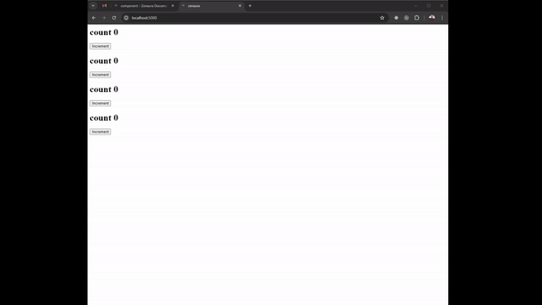

## Managing Global State with the Observer Pattern

In this guide, we'll implement a global state management system using the Observer pattern. We'll create four counters, and when Counter 1 reaches 5, all counters will reset. This example will demonstrate how to use subjects and observers to manage global state in a Zenaura application.

## Step 1: Create needed presentational components

```Python 
from zenaura.client.tags.builder import Builder
from zenaura.client.tags.node import Node, Attribute
    
def Header1(text):
    return Builder('h1').with_text(text).build()

def Paragraph(text, class_name=None):
    builder = Builder('p').with_text(text)
    if class_name:
        builder = builder.with_attribute('class', class_name)
    return builder.build()

def Div(class_name, children):
    div = Builder('div').with_attribute('class', class_name).build()
    div.children = children
    return div

def Button(class_name, text, onclick_handler=None, name=None):
    builder = Builder('button').with_attribute('class', class_name).with_text(text)
    if onclick_handler:
        builder = builder.with_attribute('py-click', onclick_handler)
    if name:
        builder = builder.with_attribute("name", name)
    return builder.build()

def CounterPresntaional(increaseBtn, headertext, count) -> Node:
    return Builder("div") \
        .with_attribute("id", "large-header") \
        .with_children(
            headertext,
            increaseBtn
        ).build()
```

## Step 2: Observer, Subject, Counter component

First, we need to import our `Observer` abstract base class and our `Subject` class that will manage the observers. Also we will define some presentational components that helps us build the counters. 

importing the `Observer`, `Subject`.
```python
from zenaura.client.observer import Observer, Subject
```
importing presentational components 

```Python 
from public.presentational import Div, Header1, CounterPresntaional, Button

```

creating the `Subject` class that will manage the observers.
and the `CounterObserver` class that will react to state changes.

```Python 

# Create the subject
counter_subject = Subject()
counter_subject.state = {"counter1": 0, "counter2": 0, "counter3": 0, "counter4": 0}


# create counter observer:
class CounterObserver(Observer):
    pass

```

now we will create the counter component, where we manage a global state between different instances of it.

```Python

@Reuseable
class Counter(Component, CounterObserver):
    def __init__(self, subject, counter_name):
        super().__init__()
        self.subject = subject
        self.subject.attach(self)
        self.counter_name = counter_name
        
    @mutator
    async def increment(self, event):
        self.subject.state[self.counter_name] += 1
        self.subject.notify()

    def update(self, value):
        if self.subject.state["counter1"] == 5:
            for k in self.subject.state.keys():
                self.subject.state[k] = 0
        asyncio.get_event_loop().run_until_complete(zenaura_dom.render(self))

    def render(self):
        return Div("container", [
            CounterPresntaional(
                Button("btn", "Increment", f"{self.counter_name}.increment"),
                Header1(f"count {self.subject.state[self.counter_name]}"),
                self.subject.state[self.counter_name],
                
            )
        ])


```
In init,

```Python
class Counter(Component, CounterObserver):
    def __init__(self, subject, counter_name):
        super().__init__()
        self.subject = subject
        self.subject.attach(self)
        self.counter_name = counter_name
```

We link every instance of the counter to the global subject, since subject will only call counterInstance.update.

In increment,
```Python
@mutator
async def increment(self, event):
    self.subject.state[self.counter_name] += 1
    self.subject.notify()
```

we decorate with mutator so the component re-renders after increment called which is user event. 

In update, 
```Python
  def update(self, value):
        if self.subject.state["counter1"] == 5:
            for k in self.subject.state.keys():
                self.subject.state[k] = 0
        asyncio.get_event_loop().run_until_complete(zenaura_dom.render(self))
```
we implement the functionality of the global state, reseting all the counters when counter 1 reaches 5. Note we are calling asycnio.get_event_loop().run_until_complete(zenaura_dom.render(self)) to render the component.

This is for the fact zenaura_dom will update the real dom asyncrounsly, in non-blocking way, and self refer to an instance of the counter which is counter 1, counter2, counter3 , counter4, this allow when the state of counter 1 reached 5, all the other counters will be reset to 0.


## Step 3: Create and Attach Counters to the Subject, create the page

Now, we'll create the counters and attach them to the subject. And create the page of the counters

### Main Application

in `main.py` :

```python
from zenaura.client.app import App, Route
from zenaura.client.page import Page
from public.components import Counter, counter_subject
import asyncio

# Create counter components
counter1 = Counter(counter_subject, "counter1")
counter2 = Counter(counter_subject, "counter2")
counter3 = Counter(counter_subject, "counter3")
counter4 = Counter(counter_subject, "counter4")

print(counter1.id != counter2.id != counter3.id != counter4.id)
router = App()
router.add_route(
    Route(
        "Home", 
        "/",
        Page(
            [counter1, counter2, counter3, counter4]
       ) 
    )
)


# Run the application
event_loop = asyncio.get_event_loop()
event_loop.run_until_complete(router.handle_location())
```

This will result in the required behavior, where the four counters are synced to a single global state as shown in the below GIF: 



## Conclusion

By implementing the Observer pattern, we can efficiently manage global state and ensure that all parts of the application react to changes. In this example, we created four counters, and when Counter 1 reaches 5, all counters reset. This approach ensures maintainability, flexibility, and separation of concerns in your Zenaura applications.

The source code for the full example is available on GitHub in the examples repository.