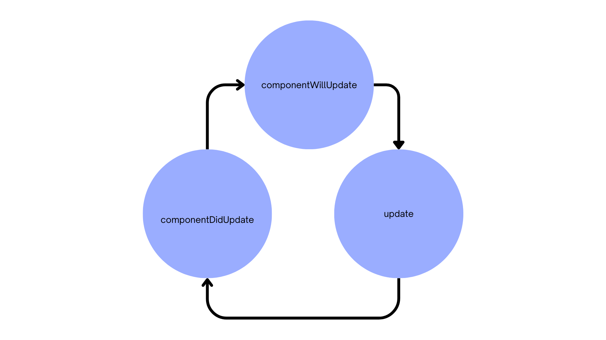

# Zenaura Virtual DOM

This release mainly address adding component lifecycle methods to zenaura.  Mainly two important lifecycles are addressed with this change :

1. mount
2. render 
3. on_error

## Mount, unmount lifecycle

- componentWillMount (curr to mount component ): triggered before virtual dom mount the component on real dom.
- mount : mount the component on the real dom.
- unmount , componentWillUnMount ( previous mounted component ): check if there is componentWillUnmount lifecycle method on previous component, if not unmount the component from virtual dom
- attached: Component is mounted, mount lifecycle is done.

## Render

- on_mutation: triggered before the virtual dom update the real dom.
- component update: component is updated.
- on_settled: component is update lifecycle is done.

## on_error

This lifecycle method wraps the dom render and mount lifecycles, mounts an error message and default error component whenever an error ocur in the virtual dom lifecycles.

# test coverage 

