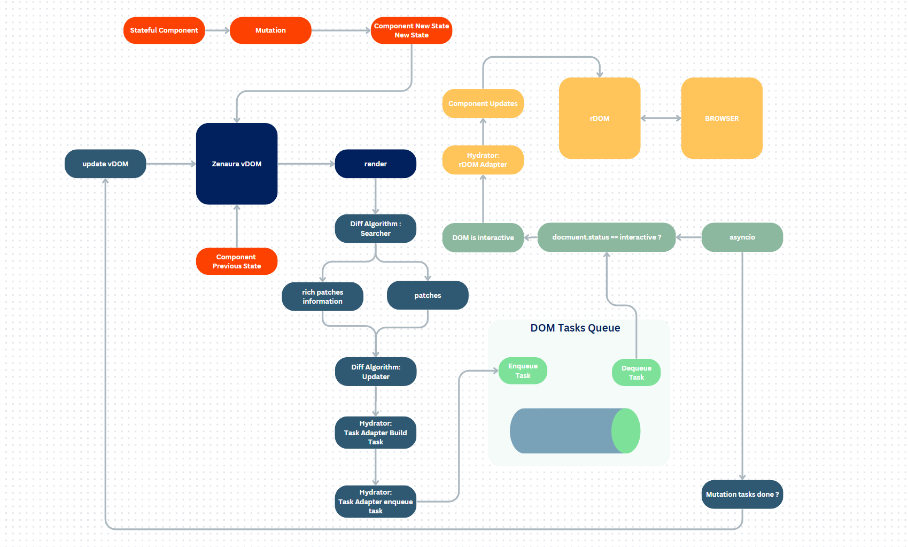

# v0.9.42

- Optimized diffing algorithm for virtual dom.
- Tested hyderator drivers.
- Search step in diffing algorithm builds patching information for updater.
- Updater create DOM updates task for hyderator tasker.
- Tasker enqueue dequeue tasks based on DOM readiness.

- Below is a diagram for the realese :

